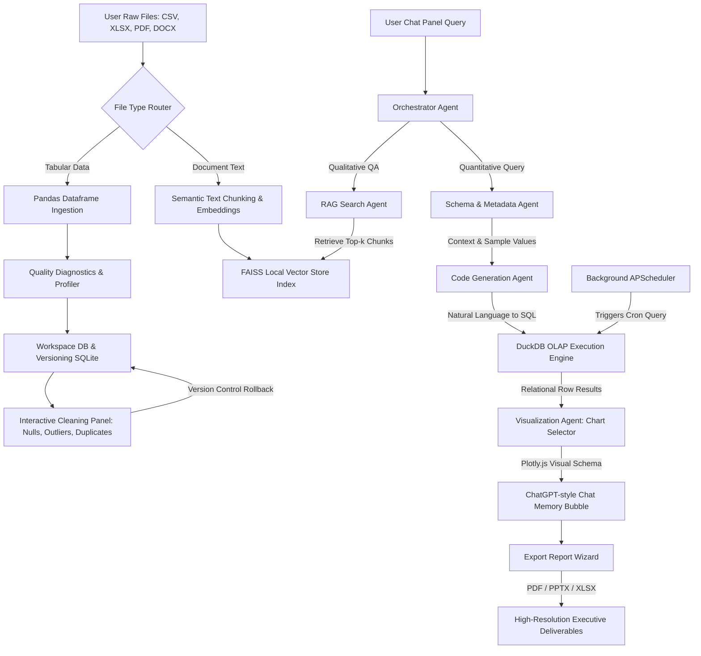

# AI-Data-Analytics-Agent 📊🤖

An enterprise-grade, premium intelligent business intelligence (BI) and automated data analytics platform. It dynamically ingests tabular datasets (CSV, Excel, TSV, Parquet) and text-heavy documents (PDF, DOCX, TXT), performs automated data quality audits, provides an interactive control panel for versioned cleaning steps, generates and runs high-performance SQL queries via a **DuckDB** engine, renders automatic interactive **Plotly** visualizations, handles semantic Q&A using retrieval-augmented generation (**RAG**), schedules recurring report compilation in the background, and bundles analytical insights into executive-ready PDF, PowerPoint, or Excel reports.

---

## 🛠️ Architecture & Technology Stack

The platform features a decoupled client-server architecture built on modern web and data science frameworks:

*   **Backend Application Server**:
    *   **FastAPI**: High-performance, fully async python REST API server.
    *   **Uvicorn**: Lightning-fast ASGI server hosting the FastAPI backend on port `8000`.
    *   **DuckDB**: Highly optimized, in-process columnar SQL OLAP database engine. Performs blazing-fast queries directly on local dataframes.
    *   **Pandas & NumPy**: Core libraries for dataframe manipulation, ingestion heuristics, data cleaning, and statistical calculations.
    *   **SQLite3**: Structured database (`backend/database/app.db`) for system metadata, persistent chat history, workspace indexing, scheduled crons, and rollback version control.
    *   **Sentence Transformers (`all-MiniLM-L6-v2`)**: Transforms textual raw document chunks into 384-dimensional dense semantic vector embeddings.
    *   **FAISS (Facebook AI Similarity Search)**: Vector index library for ultra-fast, local similarity calculations and nearest-neighbor search during RAG execution.
    *   **APScheduler**: Process-backed task scheduler executing recurring analytical updates and automatic background report compilation.
    *   **Google Gemini API (`gemini-2.5-flash`)**: Multi-agent natural language parser, SQL code generator, and semantic intelligence engine.
    *   **ReportLab, python-docx, & python-pptx**: Document compilation libraries for custom PDF rendering, Word exports, and PPTX slide building.

*   **Frontend Client Console**:
    *   **React (v19)** & **Vite (v8)**: Ultra-fast dev tooling and interactive user interface compilation.
    *   **Tailwind CSS (v4)**: Modern, utility-first CSS layout engine with glassmorphic variables.
    *   **Framer Motion**: Premium visual micro-animations and slide-in panels.
    *   **Lucide React**: Clean, minimalist vector icon assets.
    *   **Plotly.js**: Dynamic vector charts that allow interactive zoom, pan, select, and PNG download.
    *   **Axios**: Configured client-to-server HTTP API integration.

---

## 🔄 End-to-End System Workflow

The following flowchart illustrates the multi-agent execution pipeline, tracing how raw data moves through ingestion, LLM translation, query execution, visualization, and export:



---

## 📂 System Directory & File Dictionary

Here is the directory structure detailing exactly what each directory and script executes:

```
ai-data-analytics-agent/
├── .env.template              # Environment setup template (Google API keys, DB configurations)
├── .gitignore                 # Custom rules preventing local db, packages, env, caches, and node_modules from staging
├── Dockerfile                 # Multi-stage Docker config containerizing the FastAPI and build directories
├── requirements.txt           # Main python system dependencies list (with exact pinned versions)
├── main.py                    # Root workspace script launching Uvicorn to run the backend on port 8000
├── system_workflow_document.pdf # Detailed 20+ page generated PDF manual on the system architecture
├── backend/                   # Python REST Backend Core
│   ├── main.py                # Server initialization, CORS middleware configuration, and router mappings
│   ├── agents/                # Intelligent Multi-Agent System
│   │   ├── chart_recommender.py  # Selects optimal chart representations based on schema structure and query scope
│   │   ├── quality_agent.py      # Performs automated diagnostic profiles of nulls, duplicates, types, and outliers
│   │   ├── rag_agent.py          # Builds semantic FAISS indices, chunks text, and answers query questions using embeddings
│   │   ├── scheduler_agent.py    # Manages recurring background jobs and executes reports when cron fires
│   │   ├── cleaning_agent/       # Operations to drop nulls, filter outliers using IQR, and drop duplicate rows
│   │   ├── code_generation_agent/# Converts natural language requests into complex, exact DuckDB SQL
│   │   ├── insight_agent/        # Evaluates raw SQL query outputs to explain findings in clear plain text
│   │   ├── metadata_agent/       # Analyzes files to build data types, value ranges, and description indices
│   │   ├── orchestrator/         # Main router deciding whether query requires DuckDB SQL or RAG document search
│   │   ├── schema_agent/         # Extracts column properties and format contexts for LLM prompts
│   │   └── visualization_agent/  # Translates dataset fields into Plotly visual JSON formats
│   ├── api/                   # FastAPI Endpoints
│   │   ├── chart_routes.py       # Services returning custom charts or updates for individual widgets
│   │   ├── chat_routes.py        # Connects to LLM and returns assistant responses containing SQL, markdown, and tables
│   │   ├── cleaning_routes.py    # Trigger cleaning actions (impute, drop nulls, filter outliers, rollback versions)
│   │   ├── export_routes.py      # Compiles multi-section PDF, PPTX, and XLSX sheets containing text, charts, and tables
│   │   ├── profiling_routes.py   # Returns comprehensive data profiles and schemas for current datasets
│   │   ├── rag_routes.py         # Indexes uploaded documents and handles document similarity searches
│   │   ├── scheduler_routes.py   # API endpoints to register, view, or delete automated background cron schedules
│   │   ├── upload_routes.py      # Handles raw file uploads, verifies extensions, and creates active workspaces
│   │   └── workspace_routes.py   # Workspace switching, workspace creations, and listing available files
│   ├── database/              # Storage Engine Management
│   │   ├── app.db                # SQLite database storing workspaces, messages, versions, schedules (git-ignored)
│   │   ├── duckdb_manager.py     # Execution interface for DuckDB, handling file loads and queries
│   │   └── sqlite_manager.py     # Interface for workspace tables, histories, versions, and schedules in SQLite
│   ├── file_processing/       # Custom parser engines for raw files
│   │   ├── parser_factory.py     # File routing factory pointing to loader classes based on extension
│   │   ├── csv_loader.py         # Tabular loading and parsing for CSV
│   │   ├── excel_loader.py       # Multi-sheet spreadsheet parser using Openpyxl
│   │   ├── docx_loader.py        # Extracts text and structure from Word files using python-docx
│   │   ├── pdf_loader.py         # Heavy PDF reader and text layout scanner using pdfplumber
│   │   ├── parquet_loader.py     # Binary columnar database file loading
│   │   ├── tsv_loader.py         # Tab-delimited file reader
│   │   └── txt_loader.py         # Standard plaintext parser
│   ├── llm/                   # Large Language Model Connectors
│   │   ├── gemini_client.py      # Configures connection credentials and forwards generation payloads to Gemini API
│   │   └── prompts.py            # Store of system roles, SQL generation structures, and cleaning guidelines
│   ├── memory/                # Session Memory
│   │   └── session_store.py      # Transient active session configurations and in-memory caches
│   └── uploads/               # Temporary directory storing raw and clean tabular files (git-ignored)
└── frontend/                  # React Front-End Core
    ├── package.json           # Frontend javascript libraries and execution scripts
    ├── index.html             # Main entry point mounting the React app
    ├── vite.config.js         # Port settings, plugins, and builder configurations
    ├── src/
    │   ├── main.jsx           # Mounting logic that renders React inside the browser DOM
    │   ├── App.jsx            # Core layout combining the sidebar, uploads, cleaning panel, and chat console
    │   ├── App.css            # Base layouts and scroll resets
    │   ├── index.css          # Custom styling theme implementing dark glassmorphism
    │   ├── components/        # Frontend UI Components
    │   │   ├── ChartView.jsx     # Renders Plotly.js charts with custom types, zooming, and downloading tools
    │   │   ├── ChatPanel.jsx     # Scrollable dialogue board showing markdown, SQL boxes, and typing animations
    │   │   ├── ResultTable.jsx   # Grid tables displaying data query outputs with pagination
    │   │   ├── SqlViewer.jsx     # Accordion collapsible drawer displaying executed SQL queries with syntax copy-paste
    │   │   ├── UploadPanel.jsx   # Ingestion panel with file type drop zones and status updates
    │   │   └── WorkspaceList.jsx # Sidebar showing active files, workspaces, and chat cleaning buttons
    │   └── services/          # HTTP Communications
    │       └── api.js            # Unified Axios request mappings to FastAPI endpoints
```

---

## ⚙️ Step-by-Step Installation & Configuration Guide

Follow these sequential instructions to install, configure, and boot the entire platform on your local machine:

### 1. Configure the Environment
The application requires a Google Gemini API Key to run text-to-SQL logic, code generation, and insight summarization.

1. In the root directory, create a `.env` file (copied from `.env.template` if present, or generated fresh):
   ```bash
   GOOGLE_API_KEY=your_google_gemini_api_key_here
   ```
2. *(Optional)* If you want to specify a custom storage path for the SQLite metadata database, you can add:
   ```bash
   SQLITE_DB_PATH=database/app.db
   ```

---

### 2. Backend Setup & Startup

1. **Open your terminal** and navigate to the project root directory.
2. **Create a virtual environment**:
   *   **Windows**:
       ```powershell
       python -m venv .venv
       ```
   *   **macOS / Linux**:
       ```bash
       python3 -m venv .venv
       ```
3. **Activate the virtual environment**:
   *   **Windows (PowerShell)**:
       ```powershell
       .venv\Scripts\Activate.ps1
       ```
   *   **Windows (CMD)**:
       ```cmd
       .venv\Scripts\activate.bat
       ```
   *   **macOS / Linux**:
       ```bash
       source .venv/bin/activate
       ```
4. **Install backend dependencies**:
   ```bash
   pip install --upgrade pip
   pip install -r requirements.txt
   ```
5. **Run the FastAPI server**:
   ```bash
   python main.py
   ```
   *   *Alternative*: Run directly through Uvicorn:
       ```bash
       uvicorn backend.main:app --port 8000 --reload
       ```
   The backend server will spin up on **`http://127.0.0.1:8000`**. You can verify that the backend is running by opening `http://127.0.0.1:8000/docs` in your browser to view the interactive Swagger API documentation.

---

### 3. Frontend Setup & Startup

1. **Open a new terminal window** (do not close the backend terminal).
2. **Navigate to the frontend folder**:
   ```bash
   cd frontend
   ```
3. **Install npm modules**:
   ```bash
   npm install
   ```
4. **Launch the development server**:
   ```bash
   npm run dev
   ```
   The Vite dev server will spin up (typically on **`http://localhost:5173`**).
5. **Access the application**:
   Open your web browser and go to `http://localhost:5173`. You will be greeted by the dark glassmorphic console, ready for data upload and chat analysis!

---

## 🐳 Running with Docker

To run both the frontend and backend inside a single, containerized workspace environment:

1. **Build the Docker Image**:
   In the root directory of the project, run:
   ```bash
   docker build -t ai-data-analytics-agent .
   ```
2. **Run the Container**:
   Pass your Google Gemini API key as an environment variable and map port 8000:
   ```bash
   docker run -p 8000:8000 -e GOOGLE_API_KEY=your_gemini_api_key_here ai-data-analytics-agent
   ```
3. Open `http://localhost:8000` or the mapped address to access the containerized version.

---

## 🚦 System Verification & Troubleshooting

### 1. Port Conflicts
*   **Port 8000 (Backend)**: Ensure no other application (e.g., local server, development tool) is using port 8000. If you need to run on a different port, run:
    ```bash
    uvicorn backend.main:app --port 8001 --reload
    ```
    Then, update the base API URL in `frontend/src/services/api.js`.
*   **Port 5173 (Frontend)**: If port 5173 is occupied, Vite will automatically select the next available port (e.g., 5174). Check the terminal output to confirm the exact address.

### 2. Missing API Key
*   If you see `ERROR: Gemini client not configured` inside the chat bubble, verify that your `.env` file is named exactly `.env` (with a leading dot) and contains a valid key: `GOOGLE_API_KEY=AIzaSy...`
*   Ensure that there are no trailing spaces or quotation marks in the `.env` value.

### 3. Database Reset
*   If you need to completely reset the application history, workspaces, and version logs:
    1. Terminate the backend server.
    2. Delete the database file `backend/database/app.db`.
    3. Delete any local DuckDB databases (e.g. `analytics.duckdb` and backups) in the project directories.
    4. Restart the backend server. The database schemas will be regenerated automatically on startup.
